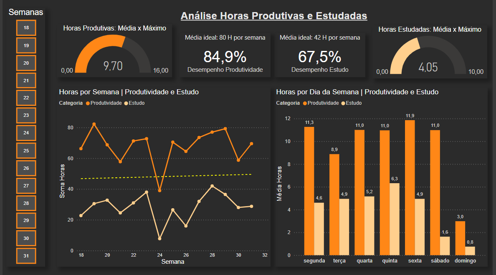

# Análise Registro de Horas

#### Neste repositório está inserido o dashboard gerado a partir dos dados de um registro pessoal de um amigo a respeito do seu tempo diário de produtividade e estudo. Esse amigo informou que o registro é feito para averiguar quando ele consegue bater sua meta pessoal de ter mais de 42 horas de estudo e 80 horas produtivas por semana. Vale esclarecer que o tempo de produtividade é igual a soma do tempo de estudo com o tempo gasto em outras atividades úteis ao seu desenvolvimento pessoal.
 

#### Na etapa de tratamento de dados foram encontrados valores de hora nulos em dias consecutivos da semana. Após analisar, foi descoberto que isso aconteceu pelo banco de dados ter sido disponibilizado na manhã da sexta-feira da semana 31 de 2022, dessa forma, as horas da sexta do sábado e do domingo ainda não haviam sido preenchidas. Posteriormente, entrei em contato, mas não obtive resposta sobre os dados faltantes.
 

#### Percebendo que a semana 31 vinha sendo construída com horas de estudo e produtividade peculiar, não quis ignorar as horas dos primeiros quatro dias da semana. Ao invés disso, julguei mais prudente e interessante preencher os dias faltantes com a média geral de horas de produtividade e de estudos destes mesmos dias. Uma outra observação importante é que segunda-feira foi definido como primeiro dia da semana.
 

#### O intuito desse projeto é aplicar meus conhecimentos adquiridos até agosto de 2022 e apresentar os dados de forma que meu amigo consiga obter informações que vão além de ter ou não alcançado a sua meta pessoal de horas. Também é esperado que ele consiga tomar decisões pessoais que o levem a ser mais produtivo e ter mais consciência de seu desenvolvimento ao longo das semanas.

 

# Dashboard

 

#### A partir dos dados dispostos neste dashboard e da aplicação dos filtros e segmentações disponíveis, é possivel obter os seguintes resultados:
 

#### • No geral, há uma suave tendência de aumento na produtividade para as próximas semanas e uma tendência um pouco maior para as horas de estudo.
#### • Porém, a tendência é negativa para ambas quando analisamos apenas as últimas cinco semanas.
#### • Menos da metade do tempo produtivo vem dos estudos. 
#### • A meta semanal de produtividade só foi batida uma vez, bem como a de estudo, porém, em semanas distintas.
#### • Um dia de pouquíssimo estudo ou dias consecutivos de muito estudo geralmente resultam em pouco foco para estudar nos dias seguintes.
#### • O desempenho nas terças-feiras tem melhorado bastante nas últimas semanas, porém, quase no mesmo rítmo, tem caído o desempenho nas quartas-feiras.
#### • Talvez uma evolução um pouco mais equilibrada, como tem sido ao longo das segundas-feiras, não prejudique o desempenho do dia seguinte.
#### • O dia de maior foco nos estudos é a quinta e o de maior produtividade a sexta.
#### • Já no sábado, apesar de ser um dia produtivo, dificilmente há estudo.
#### • Com base nas duas semanas mais produtivas e no panorama geral do sábado, é possível criar a hipótese de que o tempo produtivo advindo dos estudos é mais cansativo.
#### • A perda de foco no final de semana, principalmente no domingo, está comprometendo as metas pessoais de produtividade e estudo.
#### • Podemos inferir, com base nos domingos mais produtivos,  que manter um certo rítmo de estudo no final de semana influencia para que o início da semana seguinte seja mais produtivo. 
 
Dessa forma, é possivel indicar que a busca de um tempo de estudo mais equilibrado é o ideal no momento. Por hora, também será válido trocar a meta e, ao invés de horas fixas de produtividade e estudo, ter o objetivo superar os números da semana anterior. Além disso, manter o foco durante o final de semana e aumentar a média de horas no domingo ajudará bastante na evolução.